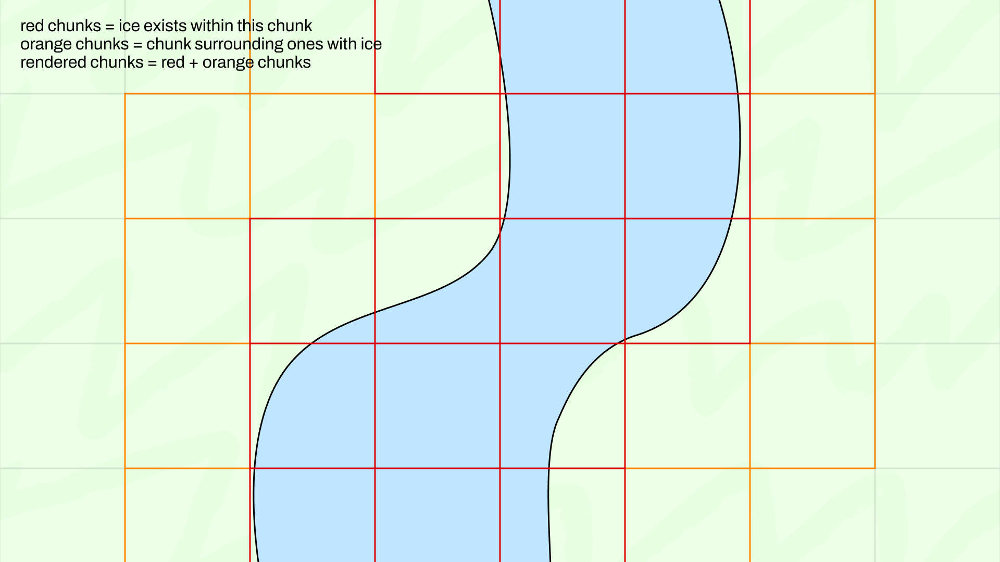

# LightBR

Chunk filtering optimization mod for ice boat racing

Video demonstration & benchmark: https://www.youtube.com/watch?v=zSyhgRuL1FQ

## What is this mod?

TLDR - it makes **only chunks around driving surfaces (ice, OBU-tagged blocks) rendered, hiding resource-heavy background decoration from many tracks.**  
See video above for visualization.
Useful when:
- you have a potato PC, or
- you have a high refresh rate screen and want to max out smoothness, by reducing CPU time dedicated to loading chunks

## Usage Tutorial

- Set keybind to toggle the mod on and off, so you can have proper visibility in server lobbies (`V` by default)
- Explore other settings by visiting the mod settings under Mod Menu

## How safe is this to use?

It's marked as Alpha since we want to integrate with ice boat racing server owners for a more seamless experience without having to toggle the mod on and off in certain scenarios.  
Also to give track makers a say in how a Minecraft client should render out their tracks.

As for the stability of this mod, it should be in a pretty good state right now.  
In case something goes wrong (like a part of the track that's supposed to be rendered isn't) you can immediately toggle off the mod with the global keybind.

## Prerequisites

- Minecraft 1.21.4
- Latest 1.21.4 Mod Menu
- Latest 1.21.4 Sodium (optional but recommended)
- 1.21.4 OpenBoatUtils 0.4.x or 0.5.x (optional)

## Issue Tracking/Reporting

It's in my Discord and Stoat server for now (choose whichever works best for you).

- https://stt.gg/0F2MBxGd
- https://discord.gg/S4NhfuWrf4
